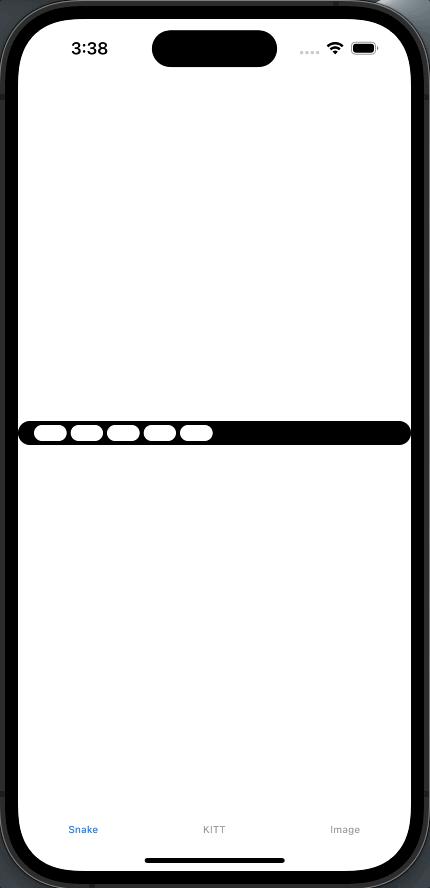
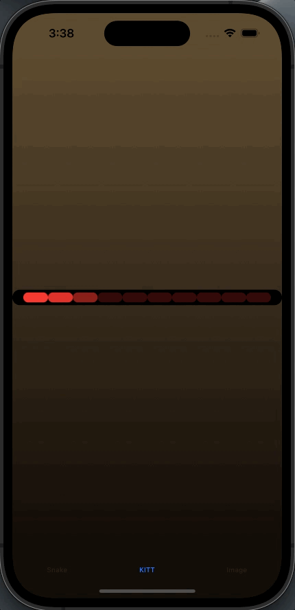
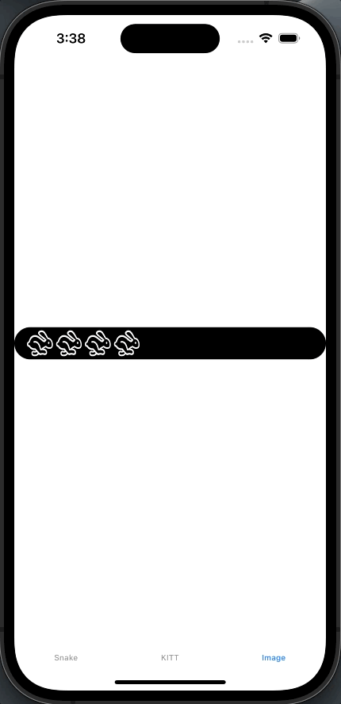

# FancyProgress

🌟Today almost all apps have the same progress views. Progress views or loading screens are fundamental, users should not get bored while waiting for a network call or a data loading. That's why I created the FancyProgress. By using the FancyProgress feature we can have different loading animations. FancyProgress will be updated over time according to requests from users. 
 
 Waiting for your feedbacks... Happy Coding!!🙂

## 
* [General info](#general-info)
* [Technologies](#technologies)
* [Installation](#installation)
* [Usage](#usage)
* [Contributing](#contributing)
* [Author](#author)
* [License](#license)

## General info
This project is a simple progress view customizer.
    
## Technologies
Project is created with:
* Swift version: 5.8
* Xcode version: 14.3.1
    
## Installation
Currently only Swift Package Manager is available.

* #### [Swift Package Manager](https://www.swift.org/package-manager)
To install this package to your project:

1. From the File menu, select Add Packages...
2. Enter "https://github.com/cagrigider/FancyProgress" into the package repository URL text field

## Usage
Currently, FancyProgress has 3 different customizable styles.

* ### Snake
Old snake style progress.

  
| Parameter Name | Description |
| ------------- | ------------- |
| maxBarCount | Number of bars. |
| spaceBetweenBars | Spacing amount between each bars. |
| barColor | Color of progress bars. |
| backgroundColor | The color of the area on which the bars stand. |
| interval | The date range over which the view should progress. |

* ### KITT
Old dream Knight Rider style progress. 

  
| Parameter Name | Description |
| ------------- | ------------- |
| maxBarCount | Number of bars. |
| barColor | Color of progress bars. |
| backgroundColor | The color of the area on which the bars stand. |
| remainingOpacity | Opacity value of the not showing dots. |
| showingDotCount | The number of dots showing around center dot while moving. |
| interval | The date range over which the view should progress. |


* ### CustomImage
A progress view with selected custom image and ratio. Developers can put custom images on loading such as company logos.

  
| Parameter Name | Description |
| ------------- | ------------- |
| progressImage | The image to show while continuing. |
| widthHeightRatio |  Width / Height ratio of the given image. |
| maxBarCount | Number of bars. |
| spaceBetweenBars | Spacing amount between each bars. |
| barColor | Color of progress bars. |
| backgroundColor | The color of the area on which the bars stand. |
| interval | The date range over which the view should progress. |

## Contributing

This is an open source project, so feel free to contribute. How?

* Open an [issue](https://github.com/cagrigider/FancyProgress/issues/new).  
* Send feedback via [email](mailto://cagrigider@gmail.com).  
* Propose your own fixes, suggestions and open a pull request with the changes.    

## Author  
[](https://www.buymeacoffee.com/cagrigider6)    

## License  
```
MIT License

Copyright (c) 2023 Çağrı Gider

Permission is hereby granted, free of charge, to any person obtaining a copy
of this software and associated documentation files (the "Software"), to deal
in the Software without restriction, including without limitation the rights
to use, copy, modify, merge, publish, distribute, sublicense, and/or sell
copies of the Software, and to permit persons to whom the Software is
furnished to do so, subject to the following conditions:

The above copyright notice and this permission notice shall be included in all
copies or substantial portions of the Software.

THE SOFTWARE IS PROVIDED "AS IS", WITHOUT WARRANTY OF ANY KIND, EXPRESS OR
IMPLIED, INCLUDING BUT NOT LIMITED TO THE WARRANTIES OF MERCHANTABILITY,
FITNESS FOR A PARTICULAR PURPOSE AND NONINFRINGEMENT. IN NO EVENT SHALL THE
AUTHORS OR COPYRIGHT HOLDERS BE LIABLE FOR ANY CLAIM, DAMAGES OR OTHER
LIABILITY, WHETHER IN AN ACTION OF CONTRACT, TORT OR OTHERWISE, ARISING FROM,
OUT OF OR IN CONNECTION WITH THE SOFTWARE OR THE USE OR OTHER DEALINGS IN THE
SOFTWARE.


```
